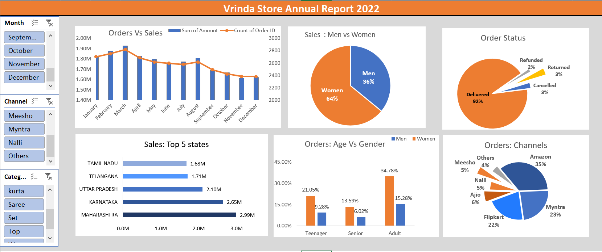

# Vrinda Store Sales Analysis

This project analyzes retail sales data using Excel.

## 📊 Dataset
The data is stored in a multi-sheet Excel file:
- Orders
- Customers
- Products

## 🔍 Analysis Performed
- Data cleaning inside Excel
- Pivot tables
- Sales analysis by category and region
- Customer behavior analysis

## 📈 Key Insights
- Identified top-performing products
- Analyzed sales trends
- Compared performance across regions

## 🛠️ Tools Used
- Microsoft Excel
  
### 🔍 Dashboard Highlights

- Displays total sales and revenue trends over time
- Shows top-performing products and categories
- Compares sales across different regions
- Highlights customer purchasing patterns

- visuals/
├── sales_trend.png
├── top_products.png
├── regions.png

## 📊 Key Insights

- Sales peak during specific months indicating seasonality
- A small number of products generate most of the revenue
- Certain regions consistently outperform others

### Dashboard Highlight

